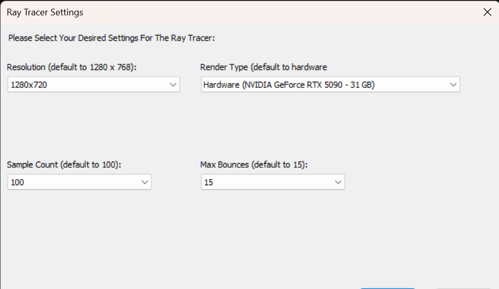

# Mini Ray Tracer (C++, HLSL, CMake)

Hello there to whoever stumbles upon this little toy of mine (it really is just a toy, considering it just outputs a single frame of the same scene forever).

This is a mini ray tracer based on Dr. Peter Shirley's Ray Tracing series: https://raytracing.github.io/books/RayTracingInOneWeekend.html. The math and physics are taken from the book, at least. The rest I did myself, more on that later.

Shout out to Dr. Shirley for putting the wonderful series online for free. And go check it out they are really useful!

---

## So, What did I do differently from the book?

* **Render Target**

  * Renders to a GUI window instead of a ppm image. This change was made because of personal preferences and my desire to practice using the WIN32 API. Isn't it nice being able to see your render without having to go through a ppm viewer?

* **Render Logic**

  * Uses multi-threaded rendering over the single-threaded rendering presented in the book's codes. This is done for performance, and to practice multi-threaded programming. The multi-threading was achieved using this thread pool implementation: https://github.com/progschj/ThreadPool/blob/master/ThreadPool.h. Credit goes to the author.

* **Render Timer**

  * Displays render time usage through a static text component. Timing is done using std::chrono in software renderer and D3D11 Query in hardware renderer. 

* **Build System**

  * Uses CMake and .bat script to allow (hopefully)easy building of the project across MSVC, GCC, and Clang (again, hopefully, "it does build on my PC"). See below for build instructions

---

## Well, what did I actually implement?

* **Application Framework (calling it an application is probably a gross overstatement)**

  * Basic GUI and window creation using WIN32. I added a small start up dialog window so user can choose their desired resolution, sample counts, trace depths, and rendering type from a set of predefined settings.
  * Frame presentation using Direct2D in software rendering process. Hardware rendering makes use of D3D11 swap chain for presentation

* **Ray Tracing & Rendering**

  * Core ray tracing maths and physics are taken from the book as stated above. This includes but not limited to: ray-sphere intersections, reflections and refractions, different materials.
  * Render result presentation logics are my own. Used D2D1 and bitmap for software (CPU) renderer, and D3D11 for hardware (GPU) rendering, which is not present in the book
  * As mentioned above, I added hardware rendering using D3D11 and an HLSL compute shader. Mostly just for the fun of it, the shader is REALLY not very efficient as you would see.

* **Optimization & Performance**

  * Not much to be done here considering the scale of this project. However, I did change how the ray tracer stores hittable objects in the scene. Instead of using arrays of shared pointers to heap-allocated sphere objects, I pulled all the sphere radius, center coordinates and material types out into their own arrays to improve cache locality. This improved the ray tracer's performance by about 50%. Data oriented design for the win!

---

## Project Status and rendering demo (the obvious yellow tint you can probably see is not produced by the ray tracer, it comes from my aggressive Night Light settings):

* **Ray Tracer Settings Window Screenshot**

* **Software Renderer Image (with depth of field)**

* **Hardware Renderer Image (no depth of field)**

* **Project status**

  * This project is finished. I might come back to it from time to time for minor improvements (at least that's the plan!).

---

## How to build

* **Prerequisites**

  * Because of the use of DX11, Win32 and other parts of the Windows SDK, this project will only build on Windows.
  * Make sure you have the Windows 10 SDK and CMake (Version 4.2.3) installed. To build with GCC or Clang, ensure they are on your PATH. This project requires C++20.

* **Build steps**

  * Clone the repo onto your pc.
  * Make sure your working directory is set to the project root.
  * Open your command line tool of choice, run the build script through ./Build.bat [Compiler name (GCC, MSVC, or Clang)].
  * The script will run CMake and build the project using the selected compiler. It will print out the success/failure status to the terminal.
  * If the build was successful, the binary executable and other build artifacts can be found in a newly created build-[compiler] folder.
  * To build with all three compilers at once, use ./Build.bat ALL. This will build all three in series (not parallel). If any one of the compilers failed to build, the successful build will still be present.

If you got this far. Thank you so much and happy ray tracing!

